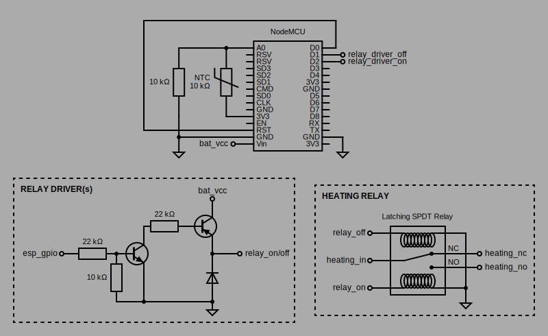

# ESPTherm


[][donation url]

**ESPTherm** is a smart thermostat and climate monitoring ecosystem project, built using _ESP8266_ devices, _MicroPython_ and _Flask_. \
The main motivation behind it was to have better control of the house heating, the original thermostat being located in a non-directly heated area.

It's comprised of:
- a central **server** application, that takes care of synchronizing and receiving data from devices.
- one or more distributed ESP8266 **devices**, such as: 
    - **thermostat** devices, that switch the heating on or off
    - **tempstation** devices, that monitor temperature (and humidity) of a certain area

## Server
The centralized **server** manages synchronization, control and data upload from devices, and serves a simple status page that displays the sensors' data (log) from the known devices:
<p align="center">&nbsp;&nbsp;&nbsp;&nbsp;</p>
Access to the status page is password protected, using a simple pinpad.
This security approach is by no means robust, it's intended as a minimum solution for unintended access prevention, and it assumes you're running the server only within your local network.

#### Installation
The server is implemented in _Python (>=3.7)_, that must be beforehand installed on your system. \
Both _Windows_ and _Linux_ environments are supported. For the latter, the included `install-server.sh` can be used to install the server as a service, in a distro using _systemd_ (and _firewalld_).

If doing a manual install, the full list of python dependencies is included in `server_requirements.txt` that can be installed using _pip_ or _conda_.

It listens by default on port `8367` and it should be run as a limited or dedicated user within your OS.

#### Configuration
The server configuration file is stored in [`/configs/server.json`](/configs/server.json). There currently are only a few configurable parameters:
- `ui_secret_code`: the pinpad numeric (max 6 digits) code used for the web UI access.
- `remote_therm`: this section is dedicated to using the thermostat in remote mode, controlling it with another temperature-sensing device:
  - `enabled`: set to `true` to enable remote thermostat mode.
  - `switch_link_id`: the full id (`<device_type>/<device_id>`) of the linked device from which to get the current temperature and hourly scheduled target temperatures used to remotely switch the thermostat device on or off.
  - `max_log_age`: the maximum acceptable age in minutes of the last log record received from the linked device. If no records more recent than this are present, the server will instruct the thermostat device to revert to the normal "schedule" operating mode.

## Devices
All _ESP8266_ devices have been programmed with _MicroPython_, for both code writing speed and versatility, and also given that performance is not an issue for the specific use case.

#### <a name="devices_flashing"></a> Flashing
The _MicroPython_ firmware used is from unofficial builds over at **[alelec / micropython-ci - GitLab](https://gitlab.com/alelec/micropython_ci)** (see latest jobs artifacts for ESP8266_LFS), due to bad support for the _LittleFSv2_ filesystem in the official ones. This is necessary, given that the devices frequently write to flash to store sensors data and internal operating state, and the default _FAT_ filesystem, lacking wear-leveling and corruption-resistant features, would have lead to faster storage degradation and frequent filesystem corruption, especially in low battery conditions.

To flash the firmware, follow the official instructions over at **[the MicroPython Documentation for ESP8266](https://docs.micropython.org/en/latest/esp8266/tutorial/intro.html)**. \
Once the firmware is setup and a Python REPL can be accessed over serial, pick your favourite tool for file upload (like [ampy](https://pypi.org/project/adafruit-ampy/)) and proceed.

The _MicroPython_ source files for devices are contained within the [`/src`](/src) directory of this repo, with code common to all devices in the root of said directory, while device-specific code is in the appropriately-named subdirectories. \
Specifically, all devices need flashing of these common files:
```
app_base.mpy
requests.mpy
ntc.py
```
**For the additional device-specific code files needed, check the appropriate sections below.**

On the target device, all code files are to be flashed in its root directory. After all files are uploaded, you can do a `uos.listdir()` while in the REPL to check that no subdirectories exist.

N.B. The `.mpy` files are bytecode-compiled _MicroPython_ files required to speed up module import time and circumvent memory limitations of ESP devices, especially for complex code. \
Beware that if the original `.py` counterparts of these files are flashed alongside compiled `.mpy` files, the former will be picked by the import mechanism at runtime instead.

#### Configuration
All devices require a device-specific config file to be flashed with the name `config.json`, with default ones found at [`/configs/<device_type>/_default.json`](/configs) in this repo. This folder is used by the server too, to load device configs and sync them if they're updated.

The config file has to be tweaked beforehand to set the appropriate values for your setup. This can be also done by creating a device-id specific config file (copying from the default one), stored in the server files like so: `/configs/<device_type>/<device_id>.json`.

Within the config file, pay special attention to tweak IP config parameters, including the server address, and the pins and calibration values of the sensors connected (like NTC, DHT, switches, etc.).

#### Initial setup
Once flashing of all the appropriate files is complete, resetting the device while connected with a serial interface, will prompt a guided setup, where you'll be requested to input WiFi credentials and a unique device ID.

### Thermostat
The thermostat device (`therm`) has one job, that is, as the name implies, controlling the heating.

#### Hardware
Most homes central heating furnaces usually provide a couple of wires that need either be shorted or disconnected to signal the heating to turn on or off. Check the installation manuals of your heating system, as they can differ a lot. \
If the wiring is such as above, all that's needed to control the heating is a latching SPDT relay, one rated for the maximum voltage your battery can output (eg. 3.0-4.5 V). You can even hijack one from your existing thermostat, if you know how to do it, don't mind hacking it and/or you're your own landlord. \
In my case, I ended up installing the *therm* ESP8266 within the existing thermostat, re-using both its AAA batteries and relay connections. Therefore I didn't implement any kind of display for this device.

The schematic is more or less as follows:
<p align="center"></p>

- The `RST` pin of the _ESP8266_ must be connected to `GPIO16` to allow for deepsleep battery saving.
- The NTC thermistor must create a voltage divider like so `3.3V - NTC - A0 - R2 - GND`, where `A0` is the ADC pin of the ESP8266, and `R2` is the voltage divider resistor, usually of the same value of nominal resistance of the NTC.
- The heating latching relay must be connected using transistor drivers (I used NPN-PNP), as the ESP8266 GPIOs cannot usually provide enough current to activate the coils. The base and pull-down resistors values should be fine tuned for the specific characteristics of the relay used, finding a good compromise between coil activation time and idle power consumption.

Many of the GPIO and resistor values can be calibrated in the config file.

#### Flashing
Follow the general instructions [above](#devices_flashing), but also flash these device-specific code files, found under [`/src/therm`](/src/therm):
```
main.py
therm_app.mpy
```

### TempStation
The temperature station device(s) (`tempstation`) sense temperature (and humidity) in a specific area of the building, send this information to the server, which in turn can use it to remotely activate the heating. \
Also, if fitted with an OLED display, they can permanently show temperature, humidity, battery and other device's info.
<p align="center"></p>

#### Hardware
The tempstation device is composed of the _ESP8266_, a _SSD1306_ OLED display (I had the SPI version readily available), a _DHT22_ sensor, a 2x*18650* li-ion battery pack with a USB charging board. \
The battery life is about 7-10 days, with the OLED display always on, a sensor update interval of 1 minute and a sync interval of 5 minutes.

The schematic is more or less as follows:
<p align="center"></p>

- The `RST` pin of the _ESP8266_ must be connected to `GPIO16` to allow for deepsleep battery saving.
- The rest of the connections are quite straightforward, with the exception of the _SSD1306_ OLED display `RST` pin. \
  To keep the display always on, even when the _ESP8266_ is in deepsleep mode, there's pull-down circuit that prevents spurious voltage spikes the ESP sends on its GPIO pins while resetting or entering deepsleep. There are also some code overrides to the _ssd1306_ library functions to send initialization commands to the display only when first powered up (cold boot). \
  The circuit has been implemented using resistors and a NPN driving transistor, although a filtering R-C circuit with a capacitor of the correct value would have probably been just as effective.

Many of the GPIO and DHT values can be calibrated in the config file.

#### Flashing
Follow the general instructions [above](#devices_flashing), but also flash these device-specific code files, found under [`/src/tempstation`](/src/tempstation):
```
main.py
tempstation_app.mpy
writer_minimal.mpy
futurahvbig.mpy
futurahvsml.mpy
```

## Contributing

Pull requests are welcome. For major changes, please open an issue first to discuss what you would like to change.

The git submodules ([webrepl](https://github.com/Hermann-SW/webrepl) and [micropython-font-to-py](https://github.com/peterhinch/micropython-font-to-py)) are optional for normal operation and can be setup with:
```bash
git submodule init
git submodule update
```

## Licence

Released under .

## Donations

Donate to the project maintainer:

[][donation url]

## Disclaimer
This is a personal project, tested and working, but not intended for mission-critical applications. Feel free use it and fork it, according to its license, at your own risk. \
Structure, specifications and code are subject to change at any time.

<!--REFERENCES-->

[donation url]: https://www.paypal.com/cgi-bin/webscr?cmd=_donations&business=PCYKW7DB34WQ4&item_name=donate+to+ESPTherm+project+maintainer&currency_code=EUR&source=url
